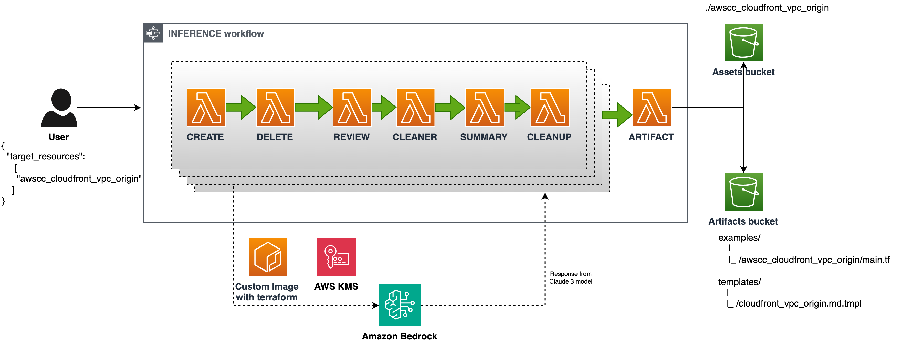
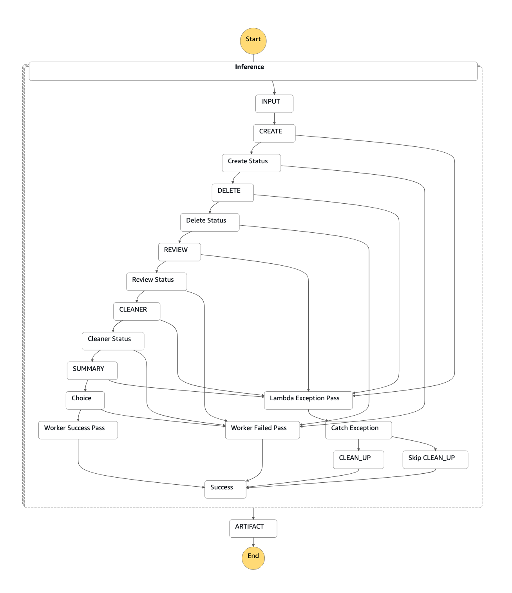

# Generate AWSCC Documentation with Bedrock and Anthropic Computer Use

This solution will generate example Terraform configuration for the specified AWSCC resource, using Amazon Bedrock as LLM provider, Anthropic Sonnet 3.5 v2 and Anthropic Computer Use.

The implementation of Anthropic Computer Use is adopted from [Anthropic Quickstarts](https://github.com/anthropics/anthropic-quickstarts/tree/main/computer-use-demo) - MIT License.



Features:

* Full orchestration of resource lifecycle (creation, testing, destruction)
* Automated validation using `terraform apply`
* Auto-generated templates ready for AWSCC repository pull requests
* Concurrent resource processing with error handling
* Comprehensive cleanup and artifact management

Sample output:

* [awscc_lambda_version](https://registry.terraform.io/providers/hashicorp/awscc/latest/docs/resources/lambda_version)
* [awscc_b2bi_capability](https://registry.terraform.io/providers/hashicorp/awscc/latest/docs/resources/b2bi_capability)
* [awscc_datasync_task](https://registry.terraform.io/providers/hashicorp/awscc/latest/docs/resources/datasync_task)

## Prerequisites

1. AWS Account with access to us-west-2 region (default)
2. Amazon Bedrock model access enabled for Claude 3.5 Sonnet v2. [How to enable Bedrock model access](https://docs.aws.amazon.com/bedrock/latest/userguide/model-access-modify.html) for `Claude 3.5 Sonnet v2 `.

If using Docker Desktop (tested on v4.35.1) you will need to disable "Use containerd for pulling and storing images" in Settings>General. ([github issue discussion](https://github.com/kreuzwerker/terraform-provider-docker/issues/534))

## Deployment

1. Clone Repository
2. Change to Terraform directory: `cd terraform`
3. Initalize Terraform: `terraform init`
4. Deploy Resources to your account: `terraform apply`
5. Ensure Amazon Bedrock model access is enabled.

This will create the required infrastructure in your AWS account.

## Usage

Invoke the Step Functions with a JSON payload containing target resources:

```json
{
  "target_resources": [
    "awscc_s3_bucket",
    "awscc_iam_role",
    "awscc_imagebuilder_workflow",
    "awscc_iotwireless_network_analyzer_configuration",
    "awscc_nimblestudio_studio_component",
    "awscc_deadline_license_endpoint",
    "awscc_datapipeline_pipeline"
  ]
}
```

You can invoke the Step Functions via the AWS Console, AWS SDK, or AWS CLI

* [Step Functions Start Execution Console Instructions](https://docs.aws.amazon.com/step-functions/latest/dg/getting-started.html)
* [Step Functions `StartExecution` AWS SDK Reference](https://docs.aws.amazon.com/step-functions/latest/apireference/API_StartExecution.html)
* [Step Functions `start-execution` AWS CLI Reference](https://awscli.amazonaws.com/v2/documentation/api/latest/reference/stepfunctions/start-execution.html) 


### AWS Step Functions Orchestration Script

The repo also includes a script which orchestrates AWS Step Functions execution and manages related S3 bucket operations. It starts a Step Function execution using input from resources.json, monitors the execution status, and downloads resulting artifacts from S3.The default region is set to `us-west-2` which you should update to the region used in your provider configuration.

```bash
./start_orchestration.sh <state_machine_arn> <s3_bucket>
```

## Security Consideration

**IMPORTANT**: By default, this solution requires admin access for the Lambda function due to the diverse range of AWS resources that may need to be created and destroyed. To implement least privilege:

* Review the resources you plan to generate
* Modify the Lambda execution role with specific permissions
* Update the IAM policies accordingly

**State file**: By default, this solution will use local state file, which synced between stages (Create, Delete, Review, etc). If you need better state file management, we are open for ideas / pull request.

## Known issues

* **Service quotas**: some resource type might failed the test because account / region level limits / quotas such as VPC.
* **Timeout**: by default the solution will attempt to create / delete / update resource within 900 seconds. Some resource might take longer and can timeout.
* **Cleanup**: we made best effort to destroy the resource regardless if create / update successfull. There is still risk that the solution unable to completely destroy all resources. Re-run the destroy process separately.

## Architecture



This Step Functions workflow orchestrates a resource generation process through multiple stages using Lambda functions. 

### Main Components

* **Map State (Inference)**: Processes input resources with a maximum concurrency of N (default is 1)
* **Sequential Processing Stages**:
  1. CREATE - Initiates resource creation
  2. DELETE - Handles resource cleanup
  3. REVIEW - Performs resource review
  4. CLEANER - Executes artifact cleanup
  5. SUMMARY - Generates artifact summary
  6. ARTIFACT - Final stage for artifact generation

### Workflow Stages

1. The workflow begins with an input of target resources
2. Each resource goes through CREATE → DELETE → REVIEW → CLEANER → SUMMARY stages
3. Successful completion generates artifacts in the final ARTIFACT stage
4. Failed operations are caught and handled with appropriate cleanup procedures

### Output Handling

* Successful operations produce target outputs
* Failed operations are marked with appropriate status and reason
* Final artifacts are generated based on successful resource processing

## Contributing

We hope this example would inspire you to create similar solution to fit your use-cases. 

Contributions to bug fixes are welcome! Please feel free to submit a Pull Request.

See [CONTRIBUTING](CONTRIBUTING.md#security-issue-notifications) for more information.

## Security

See [CONTRIBUTING](CONTRIBUTING.md#security-issue-notifications) for more information.

## License

This library is licensed under the MIT-0 License. See the LICENSE file.
