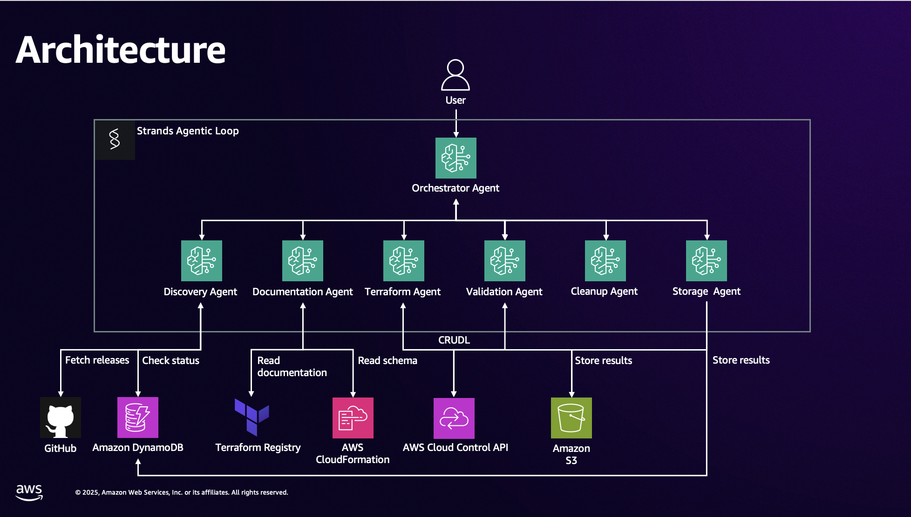

# TANGO Multi-Agent Pipeline

> **Project Attribution:** This project was developed by @ekhoro as part of the Partner Solutions Architect internship program for Summer 2025 at Amazon Web Services.

The idea behind this project is to automate the research of new AWS resources in AWSCC provider through AWS documentations, and use the knowledge to generate, test and validate Terraform configurations, before publishing it to Terraform registry. You can find example of LLM-generated code example such as  [awscc_apigateway_authorizer](https://registry.terraform.io/providers/hashicorp/awscc/latest/docs/resources/apigateway_authorizer), [awscc_appconfig_configuration_profile](https://registry.terraform.io/providers/hashicorp/awscc/latest/docs/resources/appconfig_configuration_profile), [awscc_m2_environment](https://registry.terraform.io/providers/hashicorp/awscc/latest/docs/resources/m2_environment) and more.

There is two solution in this repository:
* branch [tango](https://github.com/aws-samples/generate-awscc-with-bedrock-claude-computer-use/tree/tango) is the new solution using agentic framework StrandsAgent **recommended**. 
* branch [non-agent](https://github.com/aws-samples/generate-awscc-with-bedrock-claude-computer-use/tree/non-agent) is the original implementation using Anthropic Computer Use + Amazon Bedrock, orchestrated using state-machine.

## Overview

The TANGO Multi-Agent Pipeline is an automated system that validates AWS CloudControl (AWSCC) Terraform resources through real-world deployment testing. Using a coordinated team of AI agents, it discovers unprocessed AWS resources, generates Terraform configurations, deploys them to actual AWS environments, and produces production-ready examples with comprehensive analysis.

The system addresses a critical gap in AWS CloudControl documentation by providing validated, working Terraform examples that have been tested against live AWS infrastructure, ensuring reliability and accuracy for developers and infrastructure teams.

## Getting Started

📖 **[See USAGE.md for setup and usage instructions](USAGE.md)**

## Architecture



```
tango-multi-agent-pipeline/
├── agents/
│   ├── discovery_agent.py          # GitHub API and resource discovery
│   ├── documentation_agent.py      # Terraform code generation
│   ├── terraform_agent.py          # Terraform lifecycle operations
│   ├── validation_agent.py         # Independent validation and review
│   ├── terraform_cleanup_agent.py  # Cleans up Terraform code (removes provider blocks)
│   ├── storage_agent.py            # DynamoDB and S3 operations
│   ├── cleanup_agent.py            # Cleans up orphaned AWS resources
│   └── orchestrator_agent.py       # Coordinates all agents
├── config.py                       # Configuration settings (AWS region, S3 bucket, DynamoDB table)
├── examples/
│   └── resources/                  # 50 Successfully validated AWSCC Terraform configs
├── failed/
│   └── resources/                  # 50 Failed attempts with error analysis
├── templates/
│   └── resources/                  # 103 Markdown templates for documentation generation
├── analysis/
│   └── resource/                   # 151 Detailed validation reports and analysis
├── evaluation_agent.py             # Standalone evaluation agent
├── target_resource.py              # Target specific resources for processing
├── main.py                         # Entry point
├── USAGE.md                        # Setup and usage instructions
└── README.md                       # This file
```

## Configuration

Pipeline settings are configured in `config.py` using environment variables with defaults:

- **AWS_REGION**: Target AWS region (default: us-west-2)
- **S3_BUCKET**: S3 bucket for storing results (default: tango-project-docs)  
- **DYNAMODB_TABLE**: DynamoDB table for tracking progress (default: tango-pipeline-state)
- **DEFAULT_PROVIDER_VERSION**: AWSCC provider version (default: 1.53.0)

You can override defaults by setting environment variables or editing `config.py` directly.

## Agents

1. **Discovery Agent**: Finds unprocessed resources from GitHub releases
2. **Documentation Agent**: Generates Terraform code with correct provider versions
3. **Terraform Agent**: Executes complete terraform validation lifecycle
4. **Validation Agent**: Independent reviewer that validates terraform agent's work
5. **Terraform Cleanup Agent**: Removes provider blocks and terraform blocks from code
6. **Storage Agent**: Handles DynamoDB logging and S3 file storage
7. **Cleanup Agent**: Cleans up orphaned AWS resources from failed executions
8. **Orchestrator Agent**: Coordinates the entire workflow

## Workflow

The pipeline follows this execution order:

1. Discovery Agent identifies the next resource to process
2. Documentation Agent generates Terraform code with the correct provider version
3. Terraform Agent validates the code with real AWS deployment
4. Validation Agent performs independent review and testing of the terraform code
5. Terraform Cleanup Agent removes provider blocks and terraform blocks
6. Storage Agent stores the results in DynamoDB and S3
7. (Optional) Cleanup Agent handles any orphaned resources if needed

## Evaluation Agent

The standalone evaluation agent compares your Terraform code with official examples from the HashiCorp GitHub repository and provides quality scores, recommendations, and improvement suggestions.


## Contributing

We hope this solution would inspire you to create similar solution to fit your use-cases. 

Contributions to bug fixes are welcome! Please feel free to submit a Pull Request.

See [CONTRIBUTING](CONTRIBUTING.md#security-issue-notifications) for more information.

## Security

See [CONTRIBUTING](CONTRIBUTING.md#security-issue-notifications) for more information.

## License

This library is licensed under the MIT-0 License. See the [LICENSE](LICENSE) file.
